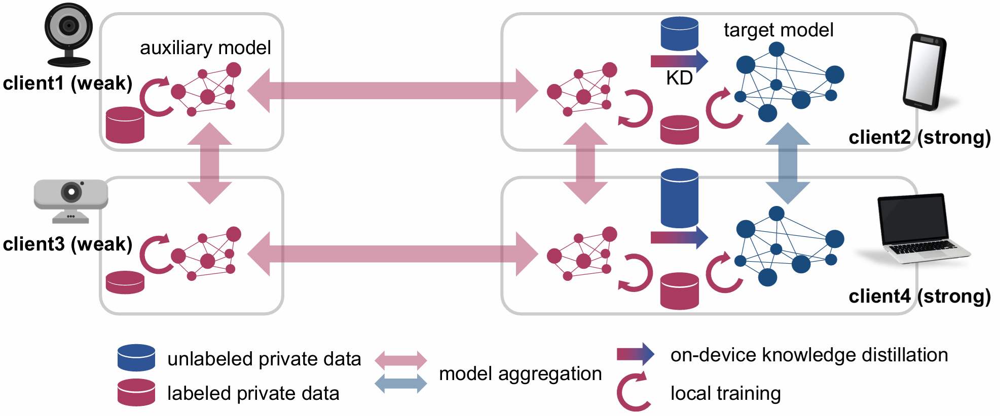

# Enabling Weak Client Participation via On-device Knowledge Distillation in Heterogenous Federated Learning
This is an official implementation of the following paper:
> Jihyun Lim, Junhyuk Jo, Tuo Zhang, Salman Avestimehr, Sunwoo Lee.<br>
 **Enabling Weak Client Participation via On-device Knowledge Distillation in Heterogenous Federated Learning**  
_European Conference on Artificial Intelligence (ECAI) 2025_.
>

The paper link is here ➔  [Paper](https://arxiv.org/abs/2503.11151) <br>
<br>

<br><br>
**Abstract**: Online Knowledge Distillation (KD) is recently highlighted to train large models in Federated Learning (FL) environments. Many existing studies adopt the logit ensemble method to perform KD on the server side. However, they often assume that unlabeled data collected at the edge is centralized on the server. Moreover, the logit ensemble method personalizes local models, which can degrade the quality of soft targets, especially when data is highly non-IID. To address these critical limitations, we propose a novel on-device KD-based heterogeneous FL method. Our approach leverages a small auxiliary model to learn from labeled local data. Subsequently, a subset of clients with strong system resources transfers knowledge to a large model through on-device KD using their unlabeled data. Our extensive experiments demonstrate that our on-device KD-based heterogeneous FL method effectively utilizes the system resources of all edge devices as well as the unlabeled data, resulting in higher accuracy compared to SOTA KD-based FL methods.

## Framework Overview
We use CIFAR-10 (Krizhevsky,Hinton et al. 2009) and the dataset is partitioned into two distinct subsets: one for training (private data) and the other for evaluating the model accuracy (public data). 
Strong clients with high system capabilities have a target model (ResNet-20) and an auxiliary model (a ResNet-20 model with 25% of the channels at each layer), while weak clients with relatively insufficient system resources have only the auxiliary model.
## Software Requirements (   )
To install the required packages for this project, you can use the `requirements.txt` file.  Follow these steps:

* **Step 1: Make sure you have Python and pip installed on your system.**
* **Step 2: Clone this repository:**

   ```bash
   git clone https://github.com/jjihyunh/Distillation
* **Step 3:  Install the required packages:**
    ```bash
   pip3 install -r requirements.txt

## Instructions
### Training
 1. Set hyper-parameters properly in `config.py`.
    
      *  **General hyperparameters** :  batch_size,  lr(learning rate),  num_classes,  epochs,  decay(epochs for learning rate decay),  weight_decay,  checkpoint(whether checkpoints are enabled (True) or disabled (False))

      *  **Algorithm-specific hyperparameters** : alpha(dirichlet coefficient),  average_interval(local update steps),  num_workers(total clients participating in Federated Learning),  active_ratio(the proportion of clients that are randomly selected in each round),  num_strongs(the number of strong clients)

 3. Run training.
      ```
      mpirun -np 2 python3 main.py
      ```
### Output
This program evaluates the trained model after every epoch and then outputs the results as follows.
 1. `loss.txt`: An output file that contains the training loss of auxiliary model for every epoch.
 2. `acc.txt`: An output file that contains the validation accuracy of auxiliary model for every epoch.
 3. `dloss.txt`: An output file that contains the training loss of target model for every epoch.
 4. `dacc.txt`: An output file that contains the validation accuracy of target model for every epoch.
 5. `./checkpoint`: The checkpoint files generated after every epoch. This directory is created only when `checkpoint` is set to 1 in `config.py`.
## Questions / Comments
 * Jihyun Lim (wlguslim@inha.edu)
